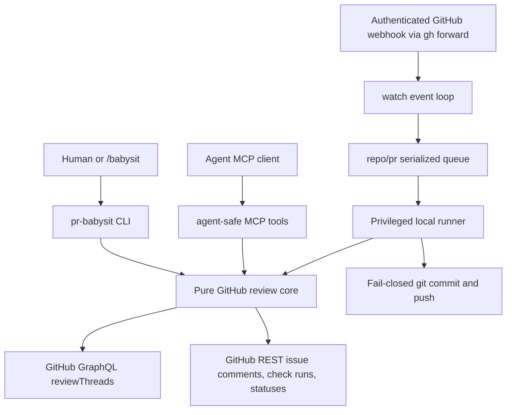

# Build TypeScript PR Babysitter

## Overview
Build `pr-babysit` as a native TypeScript product that replaces `agent-reviews` instead of wrapping it. The product has three surfaces over one shared GitHub review core: a human CLI, an agent-facing MCP stdio server, and a tiny `/babysit` skill wrapper that launches `pr-babysit watch`.

The repo is greenfield: there is no package manifest, source tree, docs, git metadata, or reusable application code. `codedb.snapshot` contains zero indexed files, so the implementation should optimize for a clean vertical slice with a hermetic fixture harness rather than migration compatibility.

## Scope
In scope: strict TypeScript scaffold, GitHub review-thread core, CLI JSON commands, MCP request/response tools, local webhook watch loop with `gh webhook forward`, local agent runner, fail-closed commit/push loop, fixture tests, and setup/safety docs.

Out of scope for v1: production webhook hosting, multi-PR watch mode, remote HTTP MCP, GitHub App check-run writes, GitHub issue-comment slash commands, fork-head PR push support, unauthenticated webhook ingress, and any runtime dependency on `agent-reviews`.

## Architecture


The shared review core owns GitHub domain logic only. The privileged local runner owns shell, agent execution, git, and push behavior. MCP wires only to the explicitly allowed review-core subset and never to runner/git capabilities.

## Repository Binding Contract
V1 `watch` must run from inside the checked-out target repository worktree. `--worktree` is out of scope for v1.

Before starting the agent, webhook forwarder, or git baseline capture, `watch` validates the current working directory:
- It is inside a git worktree.
- The selected remote is the current branch upstream remote; there is no manual remote override in v1.
- The selected upstream remote resolves to the same `OWNER/REPO` as the target PR.
- The checked-out branch matches the target PR `headRefName`.
- The PR is a same-repo PR, not a fork-head PR.
- The branch has an upstream, the worktree is clean, and all git safety checks apply only to this bound target worktree.

The `pr-babysit` project repository is only the tool implementation; product tests use disposable target repositories to prove this binding and git safety behavior.

## Webhook Secret Contract
Network watch mode requires `PR_BABYSIT_WEBHOOK_SECRET`. Fixture mode does not read or require it. `watch` uses this env var as the local verification secret for `X-Hub-Signature-256`; no other secret source or precedence exists in v1.

When starting `gh webhook forward`, `watch` must verify that the installed `cli/gh-webhook` forwarder can produce signed deliveries using the same `PR_BABYSIT_WEBHOOK_SECRET`; if the installed forwarder cannot be configured for signed delivery, network watch mode fails before opening ingress and points the user at fixture mode or a compatible extension version.

Forwarder compatibility detection is static in v1: `watch` runs `gh webhook forward --help` after ensuring the extension is installed, and the help output must expose a `--secret` option. Network watch starts the forwarder with `--secret "$PR_BABYSIT_WEBHOOK_SECRET"`. If the option is unavailable, watch exits with a clear `forwarder_unsigned` setup error before binding the webhook server.

## Runtime Model
- Ingress dedupe is by `X-GitHub-Delivery` only.
- Work serialization inside a single `watch` process is by `repo/pr`, including startup and explicit fixture reconciliation; no webhook delivery for the target PR executes outside that process-local lane. Queue wake-up coalescing may batch notifications but must never suppress unique delivery IDs or distinct actionable events.
- The lane tracks `pendingDeliveryIds`, `pendingAgentTriggers[]`, and `reconcileRequested`. Agent-triggering events append a normalized trigger to `pendingAgentTriggers`; reconcile-only events set `reconcileRequested`; all unique delivery IDs stay in `pendingDeliveryIds` until a pass consumes them.
- One processing pass snapshots and clears the current pending lane state. If any `pendingAgentTriggers` exist, the runner is invoked once with the full trigger list plus current PR context. If no triggers exist but `reconcileRequested` is true, reconciliation runs. Events arriving while a pass is running remain pending and cause a follow-up pass after the current pass finishes.
- `headSha` is a mutation precondition, not a queue key.
- Every automated GitHub or git mutation re-fetches live PR open/merged state, head, and target thread/comment state immediately before mutating. Closed or merged PRs are `unsupported_target_state` and stop the lane.
- Automation supplies an expected head SHA from `pr.get_context`; stale automation aborts rather than resolving, replying, commenting, committing, or pushing.
- Remote mutations use operation idempotency and target-state checks before side effects. Replays search the target thread/comment conversation for the canonical marker; if the intended end state is already true, the operation is a no-op; if the target no longer exists or is not actionable, it aborts with a typed error. `reply_and_resolve` and `mark_false_positive` resume safely when reply succeeded but resolve did not.
- Direct human one-shot CLI commands operate on live fetched state and must report the head SHA they acted on.
- Indirect events are actionable only when they are from the same repo and their head SHA exactly equals the current live target PR head SHA after refetch; ambiguous, fork-shared, or unmappable events are ignored with diagnostics and recovered only by startup, fixture, or later event-triggered reconciliation. V1 does not poll GitHub in the background.
- V1 supports same-repo PR heads only. `watch` refuses fork-head PRs with a clear error before starting the agent or push loop.

## Reconciliation Contract
Every reconciliation pass refetches PR open/merged state, head, review threads, top-level PR comments, and normalized checks, then returns one of three outcomes: `terminate`, `run_agent`, or `idle`.

- `terminate`: target PR is closed or merged.
- `run_agent`: PR is open and head matches, and reconciliation finds actionable work: unresolved review threads or latest-head checks with `conclusion` of `failure`, `cancelled`, `timed_out`, or `action_required`.
- `idle`: PR is open and no actionable work is present, or an indirect event is ignored by the event matrix.

Startup reconciliation uses this same contract. It must run the agent when existing unresolved review work is discovered, so missed webhook deliveries do not leave the babysitter idle forever.

## PR Conversation Comment Event Policy
Top-level PR conversation comments are flat GitHub issue comments, not threaded review replies. V1 does not infer a durable “unreplied” state for historical PR conversation comments during startup reconciliation.

`issue_comment` events enqueue an agent pass only for eligible comments on the target PR. Eligible comments are comments whose author matches the configured `--scope all|bots|humans`, are not authored by the authenticated babysit actor, and do not contain a `pr-babysit` idempotency marker. Edited comments are treated as eligible using their current author/body; deleted comments enqueue reconciliation but do not by themselves force an agent run. This prevents babysit’s own marker-bearing top-level comments from retriggering itself.

`watch --scope all|bots|humans` defaults to `all`. The scope flag applies to author filtering for review-thread work and PR conversation comment events; it does not filter check/status events. `bots` means authors detected as GitHub bot users, and `humans` means non-bot authors. Review-thread scope and actionability use the latest non-babysit comment on the thread; comments authored by the authenticated babysit actor or containing a `pr-babysit` idempotency marker are excluded from the scope decision so babysit cannot wake itself on its own unresolved reply.

Event-driven agent runs receive a normalized trigger payload in addition to the PR context. The payload includes `event`, `action`, `deliveryId`, `repo`, `pr`, optional `headSha`, optional `reviewThreadId`, optional `reviewCommentId`, optional `issueCommentId`, `author`, `isBot`, and current `body` when present. `pull_request_review_comment` payloads include `reviewCommentId` and use GitHub review-thread lookup data to include `reviewThreadId` when available. `issue_comment.created` and `issue_comment.edited` pass comment context to the runner; `issue_comment.deleted` is reconcile-only and does not by itself invoke the agent.

All runner invocations use one input shape: `runReason: "events" | "reconciliation"`, `triggers: NormalizedTrigger[]`, `target`, and `expectedHeadSha`. Event-driven runs use `runReason: "events"` and include one or more triggers. Reconciliation-driven runs use `runReason: "reconciliation"` and an empty trigger list.

## Idempotency Marker Contract
Every automated remote write includes a canonical hidden marker: `<!-- pr-babysit:id=v1:<sha256> -->`.

The marker hash is computed from canonical JSON with exactly these fields: `targetId`, `action`, `expectedHeadSha`, and `bodySha256`. `bodySha256` is the SHA-256 of the normalized visible body. Body normalization converts CRLF to LF and trims trailing whitespace on each line before hashing. Canonical JSON uses deterministic key ordering and no extra fields.

Replay lookup is always against the target thread/comment conversation on GitHub, not local process state. If the marker already exists and the intended end state is already true, the operation is a no-op. If the marker exists but the remaining terminal state is missing, such as reply present but thread unresolved, the operation resumes only the missing step when the original expected head still matches the live PR head. If the reply marker exists but live head no longer matches the original expected head, `stale_head` wins and the thread remains unresolved. This contract applies to review replies, top-level PR comments, `reply_and_resolve`, and false-positive replies.

For top-level PR conversation comments, `targetId` is the canonical `PullRequestTarget` string `OWNER/REPO#NUMBER`. V1 intentionally collapses identical automated top-level comment intent on the same PR, action, expected head, and normalized body into a no-op. Multiple identical automated top-level comments on the same head are out of scope unless a future caller-supplied purpose key is added to the marker input.

## Webhook Event Action Matrix
| Event family | Relevant actions / cases | Watch behavior |
| --- | --- | --- |
| `pull_request` | `closed` with `merged: true` or `merged: false` for target PR | terminate lane |
| `pull_request` | `opened`, `reopened`, `synchronize`, `ready_for_review`, `converted_to_draft`, `edited` for target PR | enqueue reconcile |
| `pull_request` | other actions or non-target PR | ignore with diagnostics |
| `pull_request_review` | `submitted`, `edited`, `dismissed` for target PR | enqueue agent pass |
| `pull_request_review_comment` | `created`, `edited`, `deleted` for target PR | enqueue agent pass |
| `pull_request_review_thread` | `resolved`, `unresolved` for target PR | enqueue reconcile |
| `issue_comment` | eligible `created` or `edited` on target PR conversation | enqueue agent pass with normalized trigger payload |
| `issue_comment` | `deleted` on target PR conversation | enqueue reconcile |
| `issue_comment` | babysit-authored, marker-bearing, or scope-excluded comment on target PR conversation | ignore with diagnostics |
| `issue_comment` | issue is not a PR or not the target PR | ignore with diagnostics |
| `check_run`, `check_suite`, `workflow_run`, `status` | same-repo event whose head SHA equals current live target PR head after refetch | enqueue reconcile |
| `check_run`, `check_suite`, `workflow_run`, `status` | missing head SHA, fork-shared ambiguity, non-target repo, or stale head | ignore with diagnostics |
| any subscribed event | malformed payload, missing target mapping, unsupported action | ignore with diagnostics |

## Webhook Trust Model
`watch` accepts network webhook requests only when they carry a valid `X-Hub-Signature-256` for the configured webhook secret plus required GitHub event and delivery headers. Missing secret, missing signature, invalid signature, missing event, or missing delivery is rejected. Fixture mode is explicit and file-based; it does not open unauthenticated network ingress.

## Fixture Mode
`watch --fixture <file>` disables network ingress and `gh webhook forward`, uses an injectable recorded GitHub-state adapter for startup reconciliation and per-pass refetches, then replays one or more file-mode deliveries. Fixture files model headers, delivery IDs, event names, payload paths or payload JSON, and recorded PR/thread/comment/check snapshots so delivery dedupe, idempotency, and stale-run recovery are tested without live network state.

Fixture schema:
```json
{
  "target": { "repo": "OWNER/REPO", "number": 123 },
  "startup": "startup-open",
  "deliveries": [
    {
      "id": "delivery-1",
      "event": "pull_request_review_comment",
      "headers": { "X-GitHub-Delivery": "delivery-1" },
      "payload": { "action": "created" },
      "before": "comment-created",
      "after": "reply-present"
    }
  ],
  "snapshots": {
    "startup-open": { "pr": {}, "threads": [], "comments": [], "checks": [] },
    "comment-created": { "pr": {}, "threads": [], "comments": [], "checks": [] },
    "reply-present": { "pr": {}, "threads": [], "comments": [], "checks": [] }
  }
}
```

`startup` selects the recorded state used for startup reconciliation. Each delivery can select a `before` snapshot for pre-pass refetches and an `after` snapshot for post-mutation/replay verification. When a test needs multiple refetches in one pass, the snapshot value may be an ordered array of snapshot keys; the fixture adapter advances through the array and then repeats the final state. Recovery tests model process-lost in-memory knowledge by replaying deliveries against remote snapshots that already contain the canonical marker.

## Core Contract
The core exposes canonical typed IDs for `PullRequestTarget`, `ReviewThreadId`, `ReviewCommentId`, `IssueCommentId`, `CheckRunId`, and `CommitStatusId`. CLI and MCP surface those IDs without converting between GraphQL node IDs and REST numeric IDs except through core helpers. Shared errors include `auth_failed`, `parse_failed`, `permission_denied`, `not_found`, `stale_head`, `unsupported_target_state`, `partial_mutation`, `rate_limited`, and `network_failed`.

Core auth exposes one actor identity API used everywhere for self-filtering: `getAuthenticatedActor()` returns `{ login, id, isBot }`. Authenticated actor comparisons use `id` when GitHub provides it and fall back to exact `login`; no layer may derive self identity separately.

Canonical ID wire formats are normative strings:
- `PullRequestTarget`: `OWNER/REPO#NUMBER`
- `ReviewThreadId`: `review-thread:<graphql-node-id>`
- `ReviewCommentId`: `review-comment:<graphql-node-id>`
- `IssueCommentId`: `issue-comment:<database-id>`
- `CheckRunId`: `check-run:<database-id>`
- `CommitStatusId`: `commit-status:<sha>:<context>:<createdAt-or-none>`

These exact strings are used in CLI/MCP JSON and in lexicographic tie-breaks.

Core review mutations include `replyToThread`, `resolveThread`, `replyAndResolve`, `markFalsePositive`, `listIssueComments`, and `addPrConversationComment`. `markFalsePositive` is a core capability, not MCP-only glue: it writes a visible reason with the canonical idempotency marker, then resolves with the same expected-head and target-state guards as `replyAndResolve`.

Core PR context owns the canonical fetch for PR state used by CLI, MCP, watch, and git guards. The output includes `target`, `url`, `state`, `merged`, `headSha`, `headRefName`, `baseRefName`, `isSameRepo`, `isForkHead`, `headRepository`, `baseRepository`, `author`, and `changedFiles`.

PR conversation comment list output includes `commentId`, `author`, `authorAssociation`, `isBot`, `isAuthenticatedActor`, `body`, `url`, `createdAt`, `updatedAt`, and `containsBabysitMarker`. `comments.list` and MCP `comments.list` expose this exact shape.

`ReviewCommentId` appears in `listReviewThreads` output for the individual comments inside each review thread. V1 mutations act on thread IDs, but exposing comment IDs preserves provenance for URLs, authorship, and future REST fallback without making comment IDs an automation target.

Review-thread list output includes this stable capability contract: each thread has `threadId`, `isResolved`, `isOutdated`, `path`, `line`, `rootAuthor`, `rootAuthorAssociation`, `rootIsBot`, `rootBody`, `lastCommentAuthor`, `lastCommentAuthorAssociation`, `lastCommentIsBot`, `lastCommentBody`, `url`, `commentIds`, `lastCommentId`, and `capabilities`. `watch --scope` filters unresolved review-thread work by `lastCommentIsBot` so follow-up reviewer comments drive the current scope decision. `capabilities` contains `canReply`, `canResolve`, and `canUnresolve`; each boolean reflects live PR state, thread state, and available GitHub permissions, not agent policy. Agent-safe surfaces may choose not to expose a mutating operation even when the capability is true.

## Agent-Safe CLI Contract
The watch/agent path may expose only these CLI commands to agents: `pr context`, `reviews list`, `reviews reply`, `reviews reply-and-resolve`, `reviews mark-false-positive`, `comments list`, `comments add`, and `checks list`, all with stable JSON where applicable and expected-head preconditions for mutations. Bare `reviews resolve` is human-only and must not be included in agent prompts, agent command allowlists, or watch automation paths.

Agent-exposed CLI/MCP tools are bound to the startup PR target. Agent prompts may display the target, but allowed mutating tools reject any explicit target argument that differs from the bound target. The agent MCP server is started in bound mode as `pr-babysit mcp --target OWNER/REPO#NUMBER` by `watch`; mutating MCP tools are unavailable unless the server is bound. Bare `pr-babysit mcp` is allowed for inspector/read-only use, but it cannot perform guarded mutations.

## Mutation Result Contract
Core, CLI JSON, and MCP mutation outputs use one envelope:
```json
{
  "targetId": "review-thread:PRRT_...",
  "headSha": "abc123",
  "outcome": "mutated",
  "mutated": true,
  "idempotencyKey": "v1:...",
  "replyState": "created",
  "resolveState": "resolved",
  "commentState": null,
  "url": "https://github.com/OWNER/REPO/pull/123#discussion_r..."
}
```

`outcome` is `mutated | noop | resumed | aborted | partial_mutation`. Step states are `not_applicable | created | already_present | resolved | already_resolved | skipped | failed`. `headSha`, `targetId`, `outcome`, `mutated`, and `idempotencyKey` are required; `idempotencyKey` is `null` only for human-only non-marker operations such as bare `reviews resolve`. Reply/resolve/comment step fields are present with `not_applicable` when a step is not part of the operation. Error envelopes use the same shared error taxonomy.

## Watch Failure Policy
During reconciliation and pre-mutation refetches, `auth_failed`, `permission_denied`, `parse_failed`, and `unsupported_target_state` are fatal for the current lane. `rate_limited` and `network_failed` are transient: retry with exponential backoff of 1s, 2s, and 4s while preserving queued deliveries and delivery IDs. If retries are exhausted, stop the watch process non-zero, print the last error, and do not drop queued deliveries silently.

Watch setup errors are machine-readable in CLI JSON and stable enough for tests: `not_git_worktree`, `remote_mismatch`, `branch_mismatch`, `missing_upstream`, `dirty_worktree`, `fork_head_unsupported`, `missing_webhook_secret`, `forwarder_missing`, `forwarder_unsigned`, and `gh_auth_missing`.

`watch --json` emits setup/fatal failures as one JSON object on stderr: `{ "ok": false, "code": "<watch setup code or shared error>", "message": "...", "details": {} }`. Non-JSON watch mode may print human text, but tests and automation use the JSON envelope.

## Checks Contract
`checks.list` returns a read-only normalized latest-head union of check runs and commit statuses. Each item includes `id: CheckRunId | CommitStatusId`, `kind: check_run | commit_status`, `source`, `name`, `status: queued | in_progress | completed | unknown`, `conclusion: success | failure | cancelled | skipped | timed_out | action_required | neutral | unknown | null`, `url`, `createdAt`, `startedAt`, `completedAt`, and `lastObservedAt`. For check runs, `source` is the workflow/app display name when present, otherwise the check suite/app slug, and `name` is the check-run name. For commit statuses, `source` is `commit_status` and `name` is the status context. Dedupe is per `kind + source + name`; the newest record by `lastObservedAt` wins, where `lastObservedAt` is the latest present value among `completedAt`, `startedAt`, and `createdAt`; lexicographically ascending canonical ID is the final deterministic tie-breaker. Null timestamps are allowed when GitHub omits them.

Status normalization is normative:
| Source | Upstream value | Normalized `status` | Normalized `conclusion` |
| --- | --- | --- | --- |
| check run status | `queued`, `requested`, `waiting`, `pending` | `queued` | `null` |
| check run status | `in_progress` | `in_progress` | `null` |
| check run status | `completed` + known conclusion | `completed` | mapped conclusion |
| check run status | unknown status | `unknown` | `unknown` |
| check run conclusion | `success`, `failure`, `cancelled`, `skipped`, `timed_out`, `action_required`, `neutral` | `completed` | same value |
| check run conclusion | missing while not completed | upstream status mapping | `null` |
| check run conclusion | missing or unknown while completed | `completed` | `unknown` |
| commit status state | `pending` | `queued` | `null` |
| commit status state | `success` | `completed` | `success` |
| commit status state | `failure` | `completed` | `failure` |
| commit status state | `error` | `completed` | `failure` |
| commit status state | unknown | `unknown` | `unknown` |

For commit statuses, `startedAt` and `completedAt` are `null`; `lastObservedAt` is `createdAt` when present and `null` only when GitHub omits all timestamps.

## Git History Contract
After an agent run, the new `HEAD` must be a strict descendant of the immutable `preRunHeadSha`. Rewritten ancestry, reset/rebase/amend of the baseline, unrelated local commits, and non-descendant history all block push. The eligible push set is exactly `preRunHeadSha..HEAD` after all safety checks; the implementation does not try to prove commit authorship or creation time beyond ancestry and baseline reachability. `upstreamSha` is captured for remote-advancement detection and operator diagnostics.

## Quick commands
```bash
pnpm lint
pnpm typecheck
pnpm test
pr-babysit reviews list OWNER/REPO#123 --json
pr-babysit reviews reply OWNER/REPO#123 THREAD_ID --expected-head abc123 --body "Fixed in abc123."
pr-babysit reviews reply-and-resolve OWNER/REPO#123 THREAD_ID --expected-head abc123 --body "Fixed in abc123."
pr-babysit mcp
pr-babysit watch OWNER/REPO#123 --fixture testdata/webhooks/pull_request_review_comment.created.json
```

## Acceptance
- **R1:** `pr-babysit` is a native TypeScript CLI/MCP implementation with no runtime dependency on `agent-reviews`.
- **R2:** Inline review state comes from GitHub GraphQL `reviewThreads`; PR issue comments are modeled as top-level conversation comments, not threaded review replies.
- **R3:** Automated thread closure always replies before resolving; if the reply fails, the thread remains unresolved.
- **R4:** The default MCP surface exposes synchronous request/response reads and guarded mutations only; no MCP tool performs autonomous/background polling, watches events, runs arbitrary shell, commits, pushes, or bare-resolves a thread without a reply.
- **R5:** `watch` accepts only authenticated webhook requests, dedupes by `X-GitHub-Delivery`, serializes reconciliation and delivery work by `repo/pr`, treats subscribed events according to the Webhook Event Action Matrix, treats indirect events as actionable only when their same-repo head SHA matches the current live target PR head, and fixture mode never opens network ingress.
- **R6:** Automated GitHub and git mutations must verify expected head SHA, PR open state, and freshly fetched target state immediately before mutation; stale, closed/merged, duplicate, or unsupported target states abort or no-op according to the Runtime Model and Idempotency Marker Contract.
- **R7:** `watch` always refuses dirty worktrees and fork-head PRs, and commit/push fails closed on detached or mismatched branch, missing upstream, remote advancement, rewritten ancestry, non-descendant history, and push rejection.
- **R8:** `watch` exits when a subscribed event, startup reconciliation, fixture replay, later event-triggered reconciliation, or pre-mutation open-state check observes that the target PR closed or merged.
- **R9:** `checks.list` returns the read-only normalized latest-head union defined in the Checks Contract.
- **R10:** First usable release includes README, MCP config example, auth notes, webhook authentication, fixture mode, webhook-forwarding limits, same-repo PR limitation, git safety behavior, no-change/no-empty-commit behavior, and the tiny `/babysit` wrapper contract.

## Early proof point
Task `fn-1-build-typescript-pr-babysitter.2` validates the core approach by listing unresolved review threads and performing guarded reply-before-resolve through the shared GitHub review core without `agent-reviews`. If that cannot be made reliable, reconsider the GraphQL-first design before building the watch loop or MCP surface.

## Risks
- GitHub API boundaries are easy to blur: review threads, issue comments, check runs, and commit statuses must stay separate in types and normalized intentionally.
- `gh webhook forward` is dev/test only and one forwarder per repo/org; v1 is a best-effort local operator loop with authenticated ingress and startup reconciliation, not durable production ingress.
- Always-push is sharp. The implementation must fail closed instead of relying on prompts or operator memory.
- The agent runner invokes local coding agents with their normal local permissions; babysit does not execute free-form shell/git commands parsed from agent output. Safety is enforced by scoped prompts, agent-safe tool contracts, and post-run head/git/GitHub mutation gates, not by claiming the agent process itself is sandboxed.

## References
- `.flow/config.json:2` — Flow memory is enabled in this greenfield planning workspace.
- `.flow/config.json:5` — cross-epic plan sync is disabled, so keep this as one self-contained epic.
- `.flow/config.json:9` — review backend is unset; `pr-babysit` should become the review engine rather than a wrapper.
- `.flow/meta.json:2` — fresh Flow seed with `next_epic: 1`.
- GitHub GraphQL mutations: `addPullRequestReviewThreadReply`, `resolveReviewThread`, `unresolveReviewThread`.
- GitHub webhook best practices: return quickly, dedupe via `X-GitHub-Delivery`, and validate `X-Hub-Signature-256`.
- MCP TypeScript SDK: use the production v1 line with stdio first; do not mix v2 pre-alpha package/import surfaces into v1.

## Open questions resolved for v1
- “Slash commands” means the local `/babysit` skill wrapper only; GitHub issue-comment slash commands are out of scope.
- `watch` is single-repo, single-PR, single-process, bound at startup from an explicit PR identifier passed by CLI or `/babysit`.
- False-positive decisions use core `markFalsePositive`, surfaced as `review.mark_false_positive`, with a required reason, a visible GitHub thread reply containing the canonical idempotency marker, replay-safe no-op behavior, and then resolve; there is no hidden local false-positive store.
- “Always push” means push after a successful agent run when the agent committed or when the CLI created a commit; if nothing changed and no new commit exists, skip commit and skip push.
- Webhook authentication is mandatory for network requests; fixture mode is explicit and file-based.
- Fork-head PRs are unsupported in v1; the watcher refuses them before agent execution.

## Stale-run Recovery States
- Drift before edits: abort without mutation.
- Drift after uncommitted edits: stop, leave the worktree unchanged, do not reply/resolve/comment/push, and print recovery instructions.
- Drift after local commit but before push: stop, leave the local commit unpushed, do not reply/resolve/comment, and print recovery instructions.
- Remote mutation may have succeeded but the process lost in-memory knowledge between attempts: re-fetch remote target state and apply idempotency rules before replaying.
- Push rejection: stop immediately, do not retry by force, and print push output.

## Requirement coverage
| Req | Description | Task(s) | Gap justification |
|-----|-------------|---------|-------------------|
| R1 | Native TypeScript implementation with no `agent-reviews` dependency | fn-1-build-typescript-pr-babysitter.1, fn-1-build-typescript-pr-babysitter.7 | — |
| R2 | GraphQL review threads and separate top-level PR comments | fn-1-build-typescript-pr-babysitter.2, fn-1-build-typescript-pr-babysitter.4 | — |
| R3 | Reply before resolve | fn-1-build-typescript-pr-babysitter.2, fn-1-build-typescript-pr-babysitter.3, fn-1-build-typescript-pr-babysitter.4 | — |
| R4 | Agent-safe MCP request/response tools only | fn-1-build-typescript-pr-babysitter.4 | — |
| R5 | Authenticated webhook ack, delivery dedupe, repo/PR serialization, fixture mode, indirect event matching | fn-1-build-typescript-pr-babysitter.5 | — |
| R6 | Automated mutation head guard, target-state CAS, idempotency, and stale recovery | fn-1-build-typescript-pr-babysitter.2, fn-1-build-typescript-pr-babysitter.3, fn-1-build-typescript-pr-babysitter.4, fn-1-build-typescript-pr-babysitter.5, fn-1-build-typescript-pr-babysitter.6, fn-1-build-typescript-pr-babysitter.7 | — |
| R7 | Fail-closed dirty-tree, same-repo PR, git history, and commit/push policy | fn-1-build-typescript-pr-babysitter.1, fn-1-build-typescript-pr-babysitter.6, fn-1-build-typescript-pr-babysitter.7 | — |
| R8 | Exit on observed PR close/merge | fn-1-build-typescript-pr-babysitter.5 | — |
| R9 | Read-only normalized checks contract | fn-1-build-typescript-pr-babysitter.2, fn-1-build-typescript-pr-babysitter.3, fn-1-build-typescript-pr-babysitter.4 | — |
| R10 | Docs, webhook auth, fixture mode, safety, no-change behavior, and skill wrapper contract | fn-1-build-typescript-pr-babysitter.7 | — |
